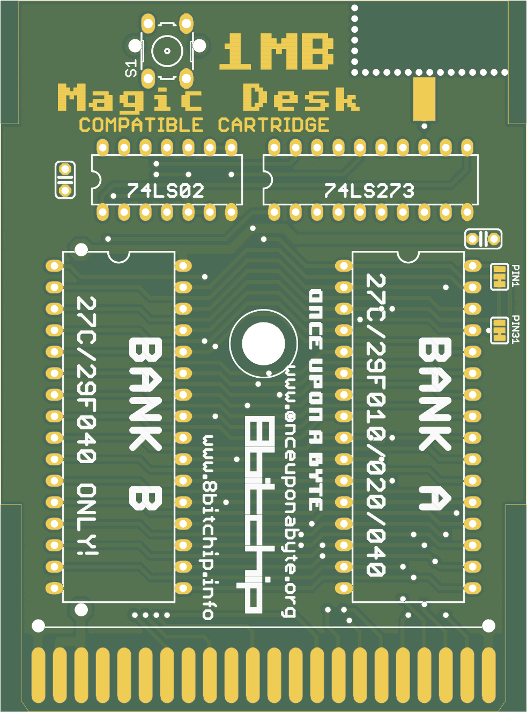

# c64-magic-desk-1024k
Hardware design of Magic Desk compatible C64 cartridge up to 1024k

This is the hardware part that accompanies the project of [Magic Desk Cartridge Generator](https://bitbucket.org/zzarko/magic-desk-cartridge-generator/)

You can order these PCBs on [PCBWay](https://www.pcbway.com/project/shareproject/C64_Magic_Desk_1024k_Cartridge.html) and help with further C64 hardware developments!



Hardware Description
--------------------

Magic Desk cartridges, in their original form, could hold up to 128Kb of code, or up to 16 banks of 8Kb each. Bank selection is done by writing to $DE00. If bit 8 is set, then EXROM is disabled and RAM in the range of $8000 - $9FFF is usable.

This cartridge expands on the idea by having 128 banks of 8Kb available, thus the maximum size is 1 Mb.

Inputs of an 8-bit latch (74LS273) are connected to the data lines. Correct decoding for the I/O1 signal is done by combining PHI2 and I/O1 trough the NOR gates of 74LS02. The only feature that is deviant from the original Magic Desk specification, is that when you disable the cartridge by writing a value of $80 or larger to $DE00, the banking mechanism gets locked and no more write attempts to $DE00 will change the register's state until a hardware reset is performed. This had to be done because some programs would unintentionally write to $DE00 (or any other location in the I/O1 range) and sometimes, if $01 is wrongly set by the program, it could result in a crash. Since the use of this particular cartrige is primarily to enable making onefile program compilations, we have decided to do it this way. If you want (or need) full compatibility with the original Magic Desk cartridge hardware, we have left a jumper to disable this behaviour. Cut the track exposed on the LOCK / NO LOCK jumper on the bottom side of the cartridge PCB, and connect it the other way around. This way the locking mechanism is disabled, but still you can remove the cartridge from the memory map by setting the bit 7 of the latch high.

The PCB was designed to accomodate various types of EPROMs and their FLASH variants. The smallest EPROM you can use is 27C010 (128Kb), and the largest is 27C040 (512 Kb). You can install two 27C040 (or 29F040) to achieve a full megabyte. Note that you cannot install two EPROMs smaller than 27C040, because there will be a "hole" in the memory space.

Jumper configuration
--------------------

In order to support all possible types of EPROMs and FLASH EPROMs, two solder jumpers had to be placed on the right side of the PCB. They look like this:

```
  PIN1         PIN31
[X X-X]       [X X-X]      
```

These jumpers are preconfigured for 29F040 FLASH EPROMs. Different types of EPROMs and their FLASH variants have some pins swapped, and if you are using a chip smaller than the maximum size, the unused adress lines have to be pulled high on the EPROM side to ensure proper functioning. The function of the jumpers are connected according to the table:

| Jumper | Pin | Description                                      |
|--------|-----|--------------------------------------------------|
| PIN1   | 1   | routes either A18 or VCC to pin 1 of BOTH EPROMs |
| PIN31  | 31  | routes either A18 or VCC to pin 31 of BOTH EPROM |

Here is the table for configuring the jumpers on most common variants of EPROMS and their FLASH counterparts.

# WARNING-THE TABLE IS NOT YET CORRECT!

```
       27C010    29F010     27C020     29F020     27C040     29F040
       ------    ------     ------     ------     ------     ------

PIN1  [X X=X]    [X X X]    [X X=X]    [X X=X]    [X X=X]    [X=X X]
PIN31 [X X=X]    [X X=X]    [X X=X]    [X X=X]    [X=X X]    [X X=X]
```

Precautions have been taken to ensure the corectness of the table above. Please, check the datasheet of your particular (FLASH) EPROM and configure the jumpers accordingly.

RESET button
------------

The pads for the RESET button will accomodate both vertical and horizontal miniature tact switch, and the two pads are there to help you to run a wire for a switch if you are putting the PCB in a cartridge case.

Enclosure compatibility
-----------------------

The PCB is designed so it can be used in various types of cartridge cases. It has been designed to fit the original Commodore cases and cases from the Polish companies KRADEX / MASZCZYK which are available at some retailers in Europe. It also fits in a 3D-prited case from the model available at Thingiverse. Unfortunately, we don't have all of the cartridge cases available in the market, so the design is NOT tested to fit with: Individual Computers', TFW8B and Shareware Plus' (and all other currently available) cases. If anyone wants to donate these types of cartridge cases, adjustments to the PCB could be made and a "one board fits all" PCB could be produced.
Please note - the cartridge cases from KRADEX / MASZCZYK are "low profile", and you cannot use a socket for the EPROM with this type of cases!

Copyright
---------

Cartridge schematics and PCB design (c) 2013-2019 Marko Šolajić

Released under GNU General Public License v3.0, see LICENSE file.
